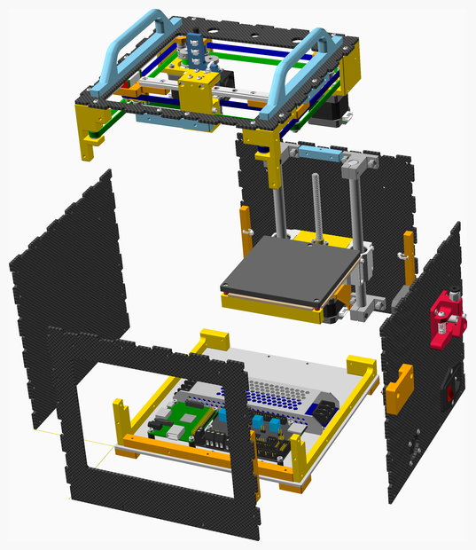
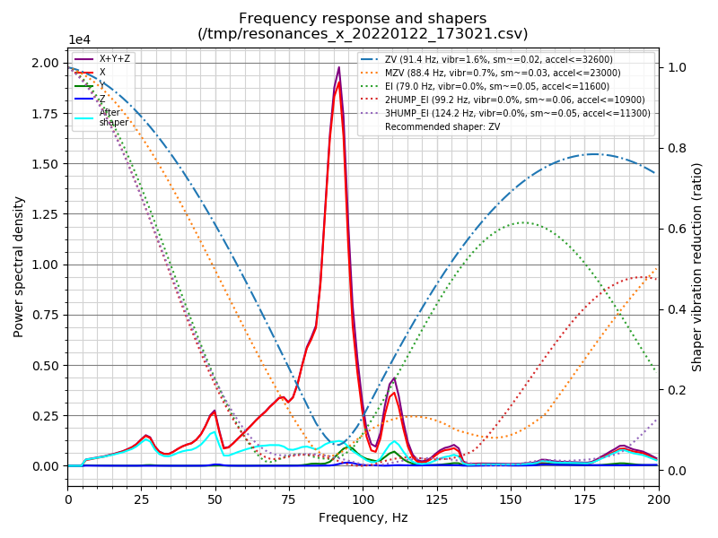
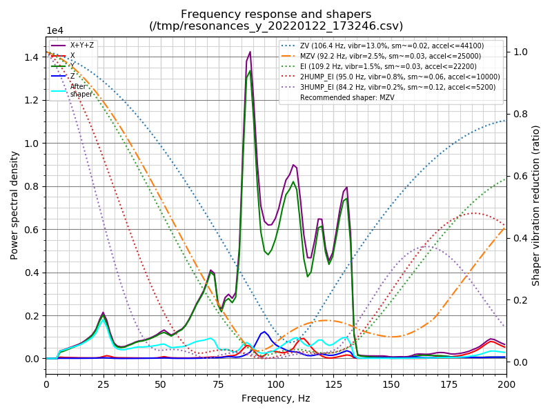
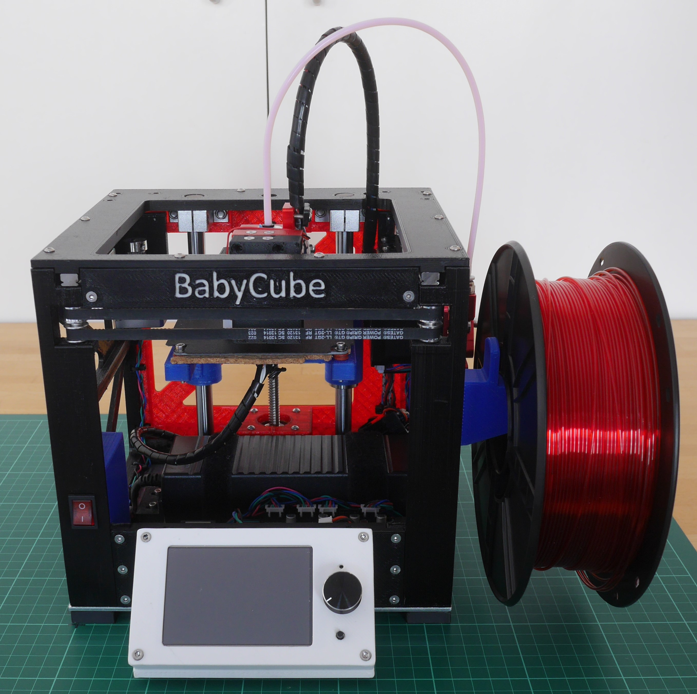
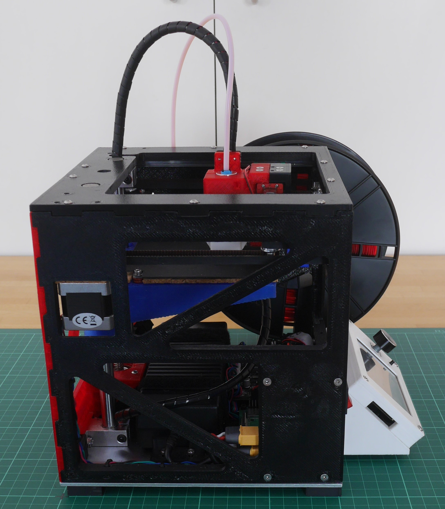
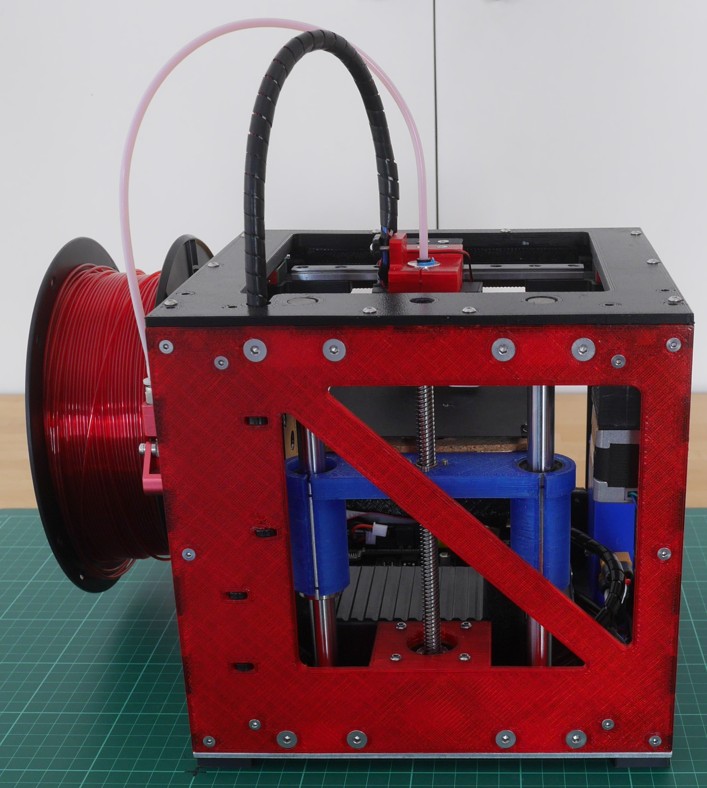
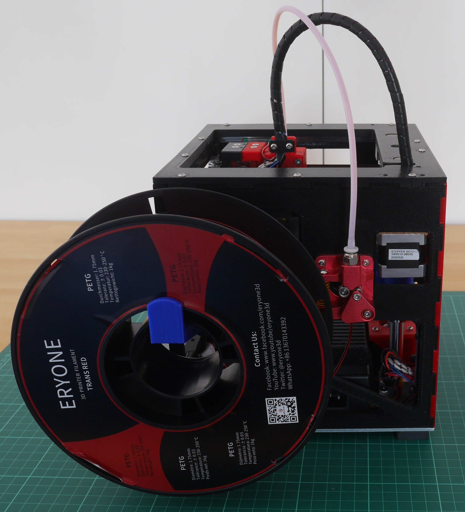
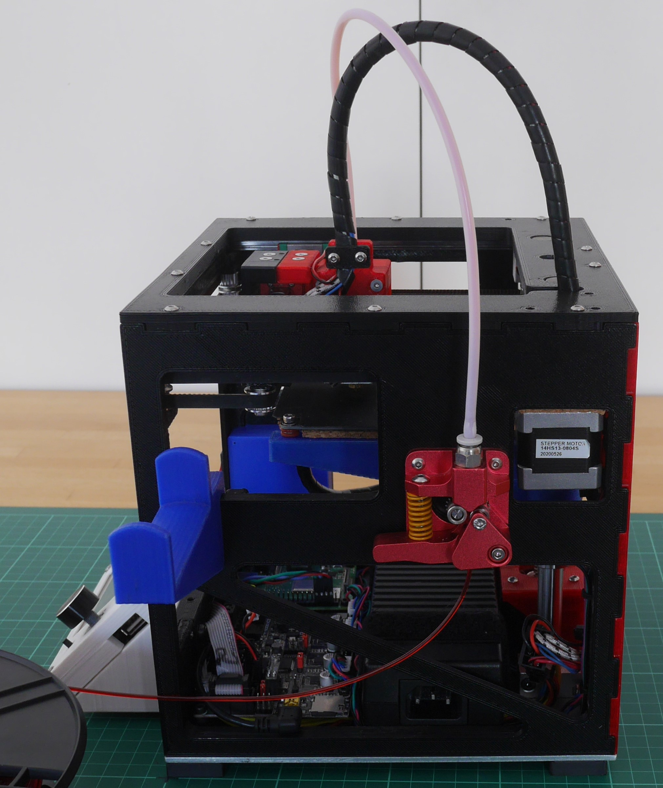
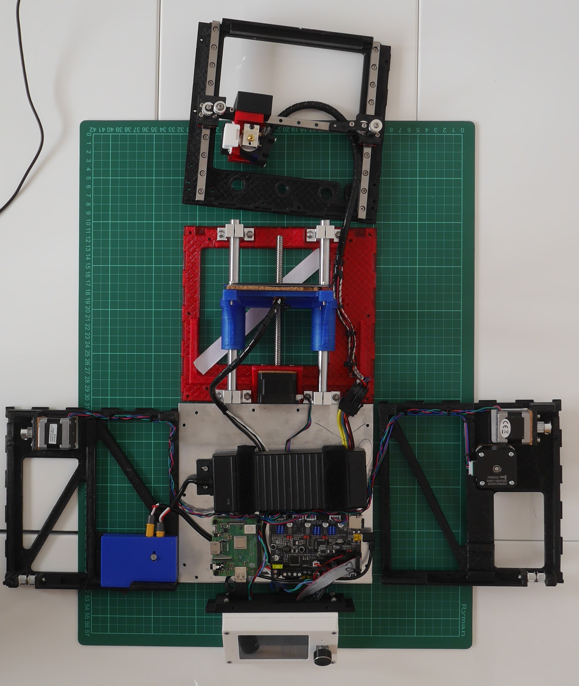

# BabyCube

The **BabyCube** is a small 3D-printed CoreXY 3D printer with a linear rails motion system.

The BabyCube has a print volume of just over 90mm by 80mm by 60mm.

The BOM cost is approximately £290 with a genuine E3D hotend (or about £250 with a generic E3D compatible hotend), this
does not include the cost of filament for printing parts, see [spreadsheet](documents/BabyCube200_BOM.ods). Price is
current for May 2021.

The dimensions of the cube are 220mm by 204mm by 203mm, and the enclosing volume (including the display, extruder,
and feet, but excluding the spool holder, Bowden tube and hotend wiring) is about 248mm by 272mm by 211mm.

Although the BabyCube is small and has a 3D printed frame, it is not a toy. It is an engineered machine capable of
producing high quality prints.

## Assembly instructions

The assembly instructions and the BOM (parts list) are [here](BC200/readme.md). Please read all the build instructions
before you begin assembly.

The STL files are on [thingiverse](https://www.thingiverse.com/thing:4911835).

A video overview of the features of BabyCube is [here](https://www.youtube.com/watch?v=HpjnHnVyvj4).

Dr Klipper had done a series of YouTube videos giving build instructions (in German). The playlist is [here](https://www.youtube.com/watch?v=Hourt_4GOHs&list=PLbNI1Rcik-oIJZLZGHtmtgYNiHBKnzX2O).
If you don't speak German, you can turn on subtitles and set auto-translate to English, or the language of your choice. He also describes the build (again in German) on his [wiki](http://www.drklipper.de/doku.php?id=videos:15_-_babycube_-_mini_corexy_drucker).

If you would like to build a bigger printer, you may be interested in the BabyCube's larger sibling, the [MaybeCube](https://github.com/martinbudden/MaybeCube)

## Key Features

1. Small portable quality CoreXY 3D printer with all parts integrated inside the frame (no external power brick)
2. Capable of printing high quality prints
3. Linear rails and NEMA 14 stepper motors used for CoreXY motion system
4. NEMA 17 stepper motors used for the extruder and the Z axis
5. Quiet operation
6. Sensorless homing on all axes

## Design Goals

The primary design goal was to produce a small 3D printer with a printable frame, external dimensions of approximately
200mm by 200mm by 200mm, and a target print volume of approximately 75mm by 75mm by 75mm.

The aim was that BabyCube could be printed on "standard" size printers, that is printers with a bed size of approximately
220mm by 220mm, such as the Ender 3 (print volume 220mm by 220mm by 250mm) and the Prusa i3 (print volume 250mm by
210mm by 210mm).

I printed my BabyCube on a BIQU B1 (which is similar to an Ender 3).

Further design goals:

1. **Make a 3D printer capable of producing high quality parts**
    * Ensure that the frame, even though 3D printed, is highly rigid
    * Use high quality components, including hotend, extruder, control boards etc
2. **Integrated design, with everything is enclosed within the printer's frame**
    * This includes the motors, the motion system, the power supply, and the circuit boards. The only exceptions are the extruder, the spool holder, the display and the connections to the hotend (wiring and Bowden tube).
    * all protrusions from frame (filament spool, extruder, power connector) are on the right hand side to minimise desk clutter and allow the back of the BabyCube to be pushed right against a wall
    * Clean wiring. Include the wiring in the design, rather than add it as an afterthought.
3. **Require minimal tools for assembly**
    * Assembly can essentially be completed using just hex keys.
    * Use self tapping holes rather than threaded inserts, they are just as strong - see [CNC Kitchen's video](https://www.youtube.com/watch?v=iR6OBlSzp7I)
    * Some small files are useful cleaning up printed parts, and optionally an M3 tap (and tap wrench) can be used to start self-tapping holes.
    * A drill with 2mm and 3mm bits is required to drill the holes in the aluminium base, but a 3D printed base can be used instead.
4. **Require minimal rework of printed parts**
    * [NopSCADlib](https://github.com/nophead/NopSCADlib) provides several features to avoid part rework.
    * All parts can be printed without supports. [Hanging holes](https://hydraraptor.blogspot.com/2014/03/buried-nuts-and-hanging-holes.html) are used to avoid supports in the display housing and the X_Carriage front.
    * Bolt holes are created using [horizontal holes](https://hydraraptor.blogspot.com/2020/07/horiholes-2.html) and [polyholes](https://hydraraptor.blogspot.com/2011/02/polyholes.html) and so are correct size and should not need redrilling.
5. **Use linear rails for the x and y axes**
    * linear rails are now not much more expensive than linear rods
    * linear rails make design and assembly easier, reducing the need for custom printed parts
    * linear rails allow a more compact design than linear rods
    * linear rods are used for the z-axis, since linear rails offer no advantage here
6. **Make the BabyCube as silent a possible**
    * Use TMC 2209 silent stepper drivers
    * The hotend fan is temperature regulated and only switches on when the hotend reaches 50&deg; Celsius
    * The the control board and stepper drivers are passively cooled by being thermally connected to the aluminium base (if either the BTT SKR E3 mini V2 or the BTT E3 turbo control boards are used).
    * The PSU is a fanless "brick" style laptop PSU.
7. **Try and keep the costs down**
    * the aim is not to be as cheap as possible, but rather to avoid unnecessary costs
    * use standard parts as far as possible
8. **Enable a variant with a carbon fiber frame**
    * see proof of concept [here](concepts/readme.md) (still a work in progress)
9. **Facilitate customisation and experimentation**
    * Open source design
    * Parametric design in [OpenSCAD](https://openscad.org/)
    * As far as possible, make it easy to partially disassemble the frame and exchange parts
    * Have space in frame for a Raspberry Pi, so that user can run OctoPrint or Klipper
10. **Support different size and material variants**
    * BabyCube's parametric design allows different size variants
11. **Be delightful**
    * A good design should have aspects that the user finds delightful

## Variants

The standard variant of the BabyCube uses and OpenBuilds 100 x 100 mm heated bed, however it is also possible to use a
120 x 120 x 6 mm aluminium tooling plate with a heating pad, see [printbed 120](PRINTBED120/readme.md).

The standard variant uses a BigTreeTech SKR Mini E3 v2.0 controller, however it is also possible to use the BigTreeTech
SKR v1.4 (and Turbo) and BigTreeTech E3 Turbo controllers.

The standard variant uses an E3D v6 hotend, but other groovemount based hotends could be used.

The standard variant uses a BigTreeTech TFT35 v3.0 display, however it should also be possible to produce "headless" variants:

* if you use the SKR v1.4 or the SKR E3 Turbo controller you can install the RepRap firmware and dispense with the display.
* you can use a Raspberry Pi and install OctoPrint or Klipper. Note that there is not enough space for a full size Raspberry Pi (eg a Pi 4), but the smaller Pi 3A+ or Pi Zero 2W will fit.

I have started to look at developing a variant with a carbon fiber frame, however this is very much a [work in progress](concepts/readme.md).

The exploded version:

## Comparisons

The following table compares the sizes and build volumes of various small 3D printers.

Printer           | Build Volume | Nominal Dimensions
------------------| -------------| -------------------
BabyCube          | 90 x 80 x 60 | 220 x 200 x 210
BabyCubeCF220     | 99 x 99 x 84 | 220 x 220 x 220
[Dice](https://www.instructables.com/DICE-a-Tiny-Rigid-and-Superfast-3D-printer/) | 90 x 75 x 80  | 200 x 200 x 200
[Rook](https://github.com/rolohaun/Rook) | 120 x 120 x 100 (est) | 220 x 250 x 280 (est)
[the100](https://github.com/MSzturc/the100) | 165 x 165 x 165 (est) |
[Voron 0](https://vorondesign.com/voron0) | 120 x 120 x 120 | 230 x 230 x 280

## Demo videos

|       | Overview | SpeedBoatRace |
| ----- | :------: | :-----------: |
| Video |  |  |

## Assembly videos

Dr Klipper had done a series of YouTube videos giving build instructions (in German). The playlist is [here](https://www.youtube.com/watch?v=Hourt_4GOHs&list=PLbNI1Rcik-oIJZLZGHtmtgYNiHBKnzX2O).
If you don't speak German, you can turn on subtitles and set auto-translate to English, or the language of your choice.

## Input shaper test results

## Pictures

## License

BabyCube is licensed under the [Creative Commons Attribution-NonCommercial-ShareAlike 4.0 International License](https://creativecommons.org/licenses/by-nc-sa/4.0/)
(CC BY-NC-SA 4.0) 

